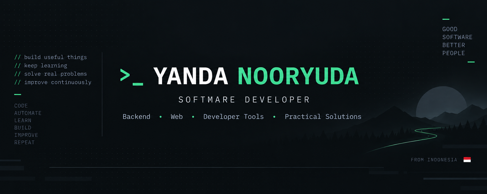

  

<h2 align="center">Hi, I'm Yanda 👋</h2>

  Software Developer from Indonesia
   
  Building web applications, backend services, and developer tools.

 

### 🛠 Tech Stack

  

### 🚀 Featured Project

**[>_ Connexio](https://github.com/yandanp/connexio)** — Project-based Terminal Manager with persistent sessions, SSH manager, task runner, and workspaces.

### 📊 GitHub Stats

  
  

  

